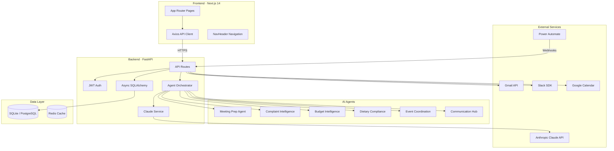
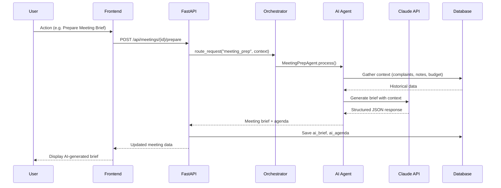
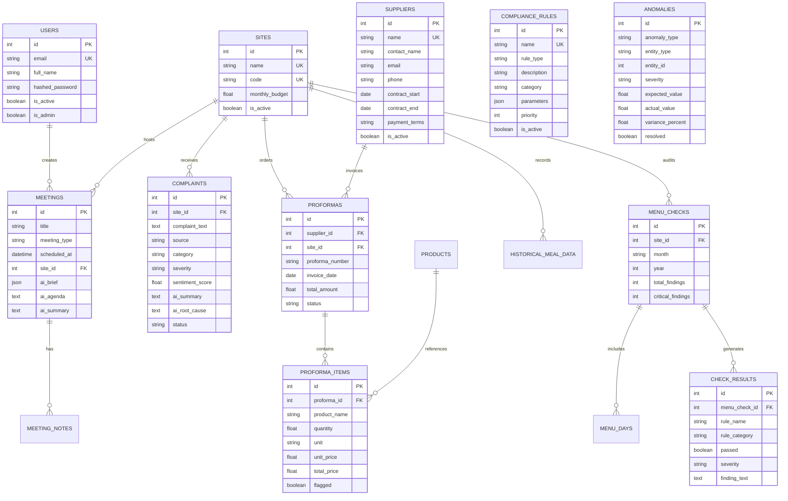
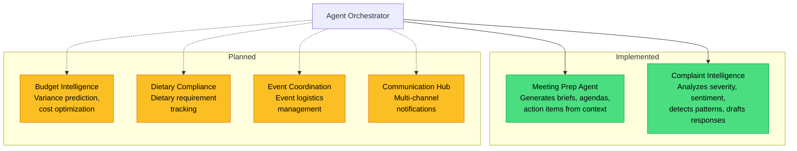
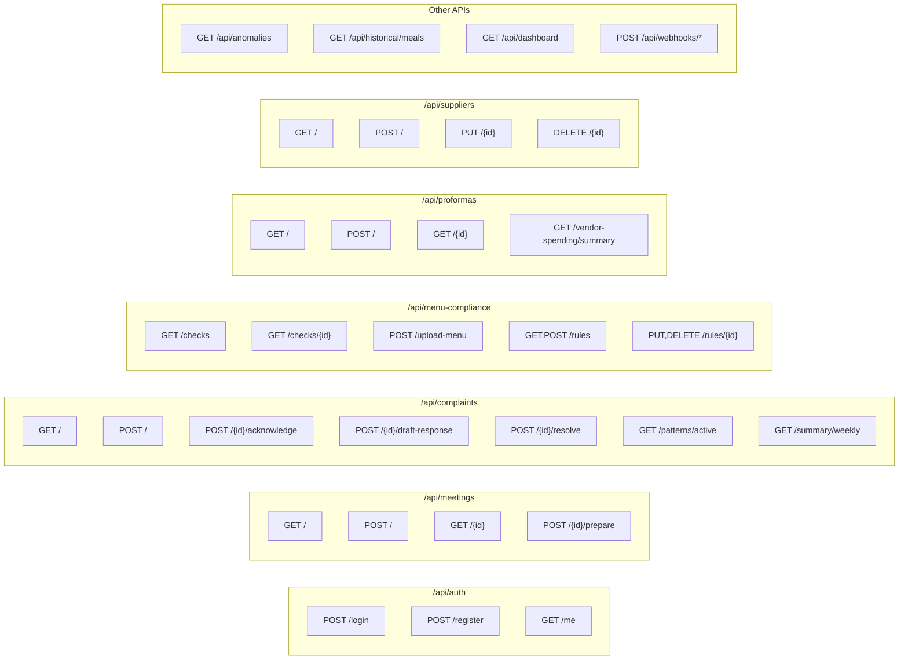
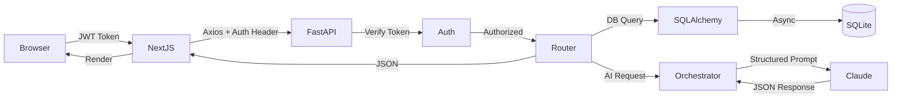

# Catering Services AI Pro

AI-native catering management system for HP Israel. Agent-driven operations management across two sites.

## Architecture Overview



## Agent Flow



## Database Schema



## AI Agents



## Tech Stack

| Layer | Technology |
|-------|-----------|
| Frontend | Next.js 14, TypeScript, Tailwind CSS, Radix UI |
| Backend | FastAPI, SQLAlchemy 2.0 (async), Pydantic |
| AI | Anthropic Claude (Sonnet 4), LangChain |
| Database | SQLite (dev) / PostgreSQL 15 (prod) |
| Cache | Redis 7 |
| Icons | Lucide React |
| Charts | Recharts |
| Auth | JWT (python-jose, passlib) |
| Integrations | Gmail API, Slack SDK, Google Calendar, Power Automate |

## Pages

| Route | Page | Description |
|-------|------|-------------|
| `/` | Dashboard | Overview metrics, quick actions |
| `/login` | Login | Email/password auth with visibility toggle |
| `/meetings` | Meetings | List, create, AI brief generation |
| `/complaints` | Complaints | Tracking, AI analysis, pattern detection |
| `/menu-compliance` | Menu Checks | Compliance audits, 68 Hebrew rules |
| `/suppliers` | Suppliers | Supplier directory, contracts |
| `/proformas` | Proformas | Invoice tracking, line items |
| `/anomalies` | Anomalies | Price spikes, usage anomalies |
| `/analytics` | Analytics | Historical trends, spending analysis |

## API Endpoints



## Request Flow



## Project Structure

```
catering-services-ai-pro/
├── backend/
│   ├── agents/                    # AI agent system
│   │   ├── base_agent.py          # Abstract base agent
│   │   ├── orchestrator.py        # Request routing
│   │   ├── meeting_prep/          # Meeting brief generation
│   │   ├── complaint_intelligence/# Complaint analysis
│   │   ├── budget_intelligence/   # Budget analysis (stub)
│   │   ├── dietary_compliance/    # Dietary rules (stub)
│   │   ├── event_coordination/    # Event mgmt (stub)
│   │   └── communication_hub/     # Notifications (stub)
│   ├── api/                       # FastAPI route handlers
│   │   ├── auth.py                # JWT authentication
│   │   ├── meetings.py            # Meetings CRUD + AI
│   │   ├── complaints.py          # Complaints + patterns
│   │   ├── menu_compliance.py     # Menu checks + rules
│   │   ├── proformas.py           # Invoice management
│   │   ├── suppliers.py           # Supplier CRUD
│   │   ├── anomalies.py           # Anomaly detection
│   │   ├── historical.py          # Historical data
│   │   ├── dashboard.py           # Dashboard metrics
│   │   └── webhooks.py            # Gmail/Slack/Calendar
│   ├── models/                    # SQLAlchemy models (19 tables)
│   ├── services/                  # Claude API wrapper
│   ├── tests/                     # pytest test suite
│   ├── main.py                    # FastAPI app entry
│   ├── config.py                  # Pydantic settings
│   └── database.py                # Async DB sessions
├── frontend/
│   ├── src/
│   │   ├── app/                   # Next.js App Router pages
│   │   │   ├── page.tsx           # Dashboard
│   │   │   ├── login/             # Authentication
│   │   │   ├── meetings/          # Meeting management
│   │   │   ├── complaints/        # Complaint tracking
│   │   │   ├── menu-compliance/   # Compliance audits
│   │   │   ├── proformas/         # Invoice tracking
│   │   │   ├── suppliers/         # Supplier directory
│   │   │   ├── anomalies/         # Anomaly alerts
│   │   │   └── analytics/         # Reports & trends
│   │   ├── components/
│   │   │   ├── layout/            # AppShell, NavHeader
│   │   │   └── ui/                # Reusable components
│   │   └── lib/
│   │       └── api.ts             # Axios API client
│   ├── package.json
│   └── tailwind.config.js
├── scripts/                       # Setup & migration utilities
├── docker-compose.yml             # PostgreSQL + Redis + App
├── requirements.txt               # Python dependencies
└── .env                           # Environment config
```

## Getting Started

### Prerequisites

- Python 3.11+
- Node.js 18+
- Anthropic API key

### Backend

```bash
pip install -r requirements.txt
cp .env.example .env  # Add your ANTHROPIC_API_KEY
python -m backend.main
```

Backend runs on `http://localhost:8000` — API docs at `/docs`

### Frontend

```bash
cd frontend
npm install
npm run dev
```

Frontend runs on `http://localhost:3000`

### Docker (Production)

```bash
docker-compose up -d
```

Starts PostgreSQL, Redis, backend, and frontend.

### Running Tests

```bash
pytest
```

## Data

Production data migrated from FoodHouse Analytics:

| Entity | Count |
|--------|-------|
| Suppliers | 2 |
| Proformas | 53 |
| Proforma Items | 11,497 |
| Compliance Rules | 68 (Hebrew) |
| Menu Checks | 2 |
| Check Results | 1,118 |
| Menu Days | 45 |
| Products | 89 |
| Categories | 12 |

## Sites

| Code | Name |
|------|------|
| NZ | Nes Ziona |
| KG | Kiryat Gat |

## Roadmap

- [x] Phase 1: Meeting Prep Agent
- [x] Phase 2: Complaint Intelligence Agent
- [x] Frontend: All 9 pages with CRUD
- [x] Real data migration from FoodHouse Analytics
- [ ] Phase 3: Budget Intelligence Agent
- [ ] Phase 4: Event Coordination Agent
- [ ] Phase 5: Dietary Compliance Agent
- [ ] Phase 6: Communication Hub Agent
- [ ] Power Automate Integration

## License

Private — HP Israel Internal Use
